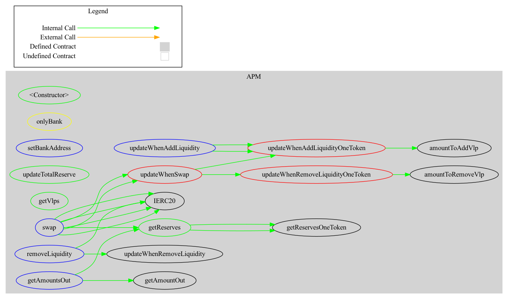

## Debond-APM.
### About: 
This module consist of smart contract for Automated Pair Maker, which acts as the single consolidated pool (also called Virtual Liquidity Pool ) as the addition/removal of the liquidity of the pool   (done via bank ), after they are issued the bond defining the transaction. Along with that it also allows swaps between the different virtual pool pairs between the bond,nonce classes being validated (as purchaseable) by the banks.


##  contract description: 

[APM.sol](./contracts/APM.sol) consist of the following storage contracts:

```solidity
    mapping(address => uint256) internal totalReserve; // mapping of (Bond Tokenised Address => supply of token overall ).
    mapping(address => uint256) internal totalVlp; (mapping of the total volume of liquidity pair)
    mapping(address => mapping( address => uint) ) vlp; // mapping of the token address => bond address => value.
```


## Development workflow: 
1. Bank contract calls the issue() function to when the user buys / stakes the bonds, this then calls internally `function updateWhenAddLiquidity(amountA , amountB ,  tokenA ,  tokenB )  `  which then adds the liquidity in APM along with  updates the mapping of the bonds as wells as tokens` . 


2. also for allowing the P2P swapping of the tokens during the redemption time , bank calls the `function `

### Security consideration.

**NOTE: Anyone can put the liquidity in the APM without going through the traditional process of issuing bonds on the bank, its MUST NOT be done  as you will LOOSE THE FUNDS as there are no  methods to remove liquidity unless users is issuing  via bank in order to redeem the bond and hence return the liquidity**


## reports: 

1.[markdown report for functions](./docs/APM_report.md).

### Overall diagram.



3.[APM functioning graph](./docs/APM-graph.png)

### deployment steps : 
1. Add private key info in the .env file (having permissions of the governance) and the settings of RPC provider for the deployment.

2. Insure that test are passing, then deploy the APM as following:
```bash
> truffle deploy deploy/3_deploy_contract.js.
```

3. then set the corresponding address of dependency `APMRouter`,(ie DebondToken,  `Bank`, `Bond` and `Governance`) using the methods of governanceOwnable depdndencies. 


