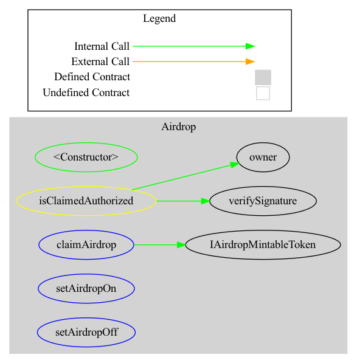

# Debond-Airdrop: 

- This repo consist of Airdrop contract that allows to  allot the fixed airdropSupply of DBIT/DGOV tokens to the whitelisted users with fixed quantity. Its offchain computation of merkle proof but, thus being scalable  to virtually till  type(uint256).  we use the following [implementation](https://medium.com/@PhABC/off-chain-whitelist-with-on-chain-verification-for-ethereum-smart-contracts-1563ca4b8f11).

- if the address is verified, it can claim whole amount of DBIT/DGOV tokens by calling the function from DeBond-Token.

- Overall `_airdropSupply` (and allocation) of the AirdropToken can only be  be changed by governance.


## Structs: 


we use only `mapping(address => bool) public withdrawClaimed` to check whether then addresses which are included in the signature verification offchain have recovered their amt of claim tokens once and for all.

## Deployment steps: 
```bash

##1. add .env with the variables : 1. DEPLOYER:  address of the governance 2. MAINNET_PRIVATE_KEY  for airdrop creation 3. INFURA_RPC.

##2. Specify the airdrop token parameter to be deployed (by changing the address in `AirdropMintableToken` with the actual address).

##3. Run the command for deploy:  

> npm run deploy --network migrations/3_Airdrop_Contract.js '<<same network as token>>'.


##4. Now using the governance, Define the  airdropAddress in debond-token by calling `DebondToken.setAirdropAddress()`  for debond-token in order to fullfill condition onlyAirdropToken for claiming the airdrop tokens.

##5. Now write  all the address (along with their allocation, as explained in [airdropGenerator](https://github.com/Debond-Protocol/Debond-Airdrop/blob/main/scripts/airdropGenerator.ts#L13)). and then running  script with `ts-node run airdropGenerator.ts`.


###6. then owner contract can initiate the contract by calling `setAirdropOn`.
```
## Dependencies: 
1. Insuring that governance has set the supply parameters of the airdrop .
2. MAINNET_PRIVATE_KEY should not get compormised as its core for the verification of the signatures of the addresses claiming their token share. 


## diagram 
