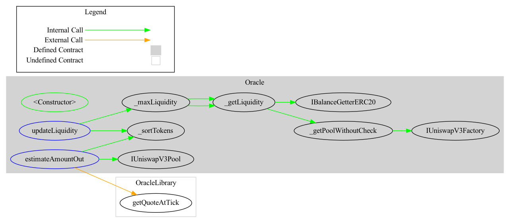

# Debond-Oracle

contract for determining the USD price  equivalent of given ERC20 , which is used by CDP functions for allowing any custom ERC20 to be minted to DBIT bond during issue bonds. we have created wrapper on top of uniswapV3 TWAP  contract.


## structures

the mapping of token pairs with the pool address is defined by `mapping poolAddresses(tokenA => tokenB => poolAddress)` this is then used for finding the pool address 

## workflow:

- frontend calls the `updateLiquidity` function for finding  the pool address with maximum liquidity, whether the pool for (ERC20,stablecoin) is available in Uniswap V3.
- then calling `getAmountsOut()` function with the parameters (tokenAddress, amount of tokensIn, outward token denomination and the duration for the timeWindow for average calculation of price).


## deployment steps:

1. Add the governance address key in env in order to refer to the `governanceAddress` during the deployment.

```bash
> npm truffle deploy

```

2. integrate into the frontend application / smart contract by writing the hook methods for updating the `poolAddress` and  .


## Security consideration:

 dependence on the uniswap oracle: currently we only reference the uniswap V3 TWAP for finding the token price in USD. given the events of depegging and other events happening in the DeFI ecosystem, there must be stopgapp mechanisms during the time of crisis (either in the uniswap or the larger black swan event). 


## Diagram: 

.